# Сборка платы v0.9 от EU2TT и монтаж её в корпус
## О версии платы
Это бета версия платы не очень удобная для монтажа и впихивания в корпус. Также, не удалось скомпановать корпус так чтобы можно было подключать USB кабель не разбирая корпуса. Возможно, будет улучшенная версия. Плата проверена и функционально полностью работоспособна. 

## Сборка платы
Файлы для изготовления платы и их описание можно найти [здесь](../PCB/EU2TT/README.MD).

Для монтажа платы используются резисторы и конденсаторы 100n типоразмера 0805 но, при большом желании, можно использовать типоразмер 0603:

**Внимательно порочитайте** [описание платы](../PCB/EU2TT/README.MD) **особенно в части питания OLED**. Перемычки должны быть запаяны, например, так:

Собранная плата выглядит так:

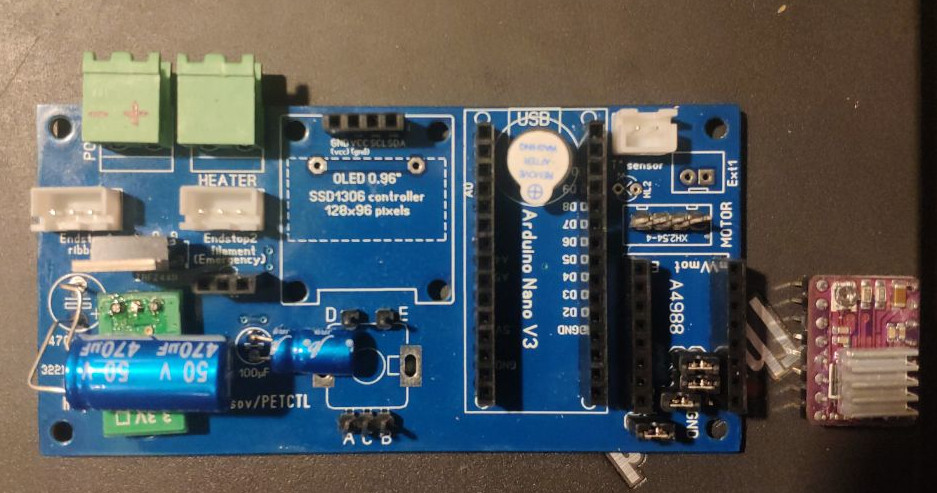
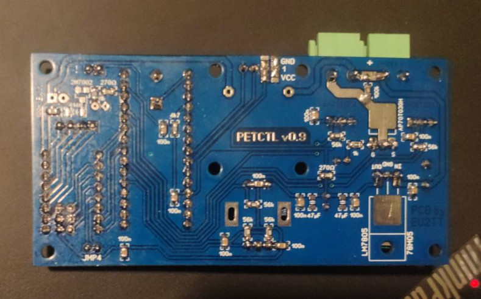

Это первая, разработанная нами, версия (бета) платы и она не "оптимизированна" для сборки. Узел где расположен входной фильтрующий (конденсатор), преобразователь 24В в 5В и ключ нагревателя удалось собрать так:

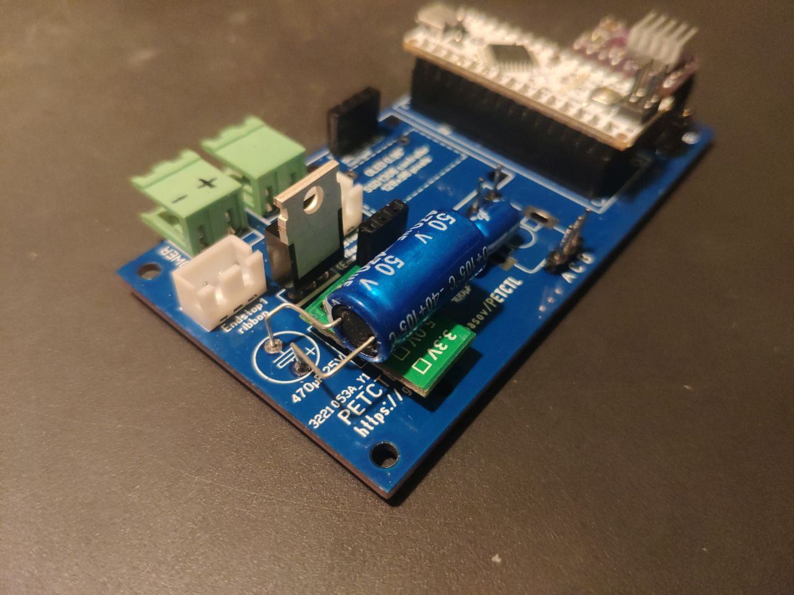
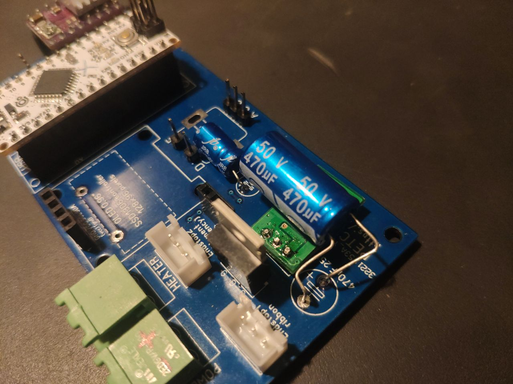
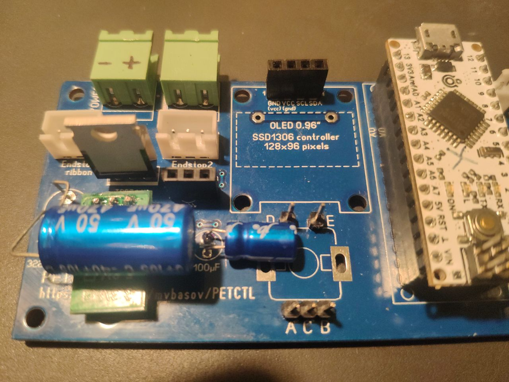

Обвязка дополнительного ключа (VT2, 2N7002) запаяны а сам ключ и светодиод нет. В прошивке это не используется. Резерв на будующее.

На плате Arduino nano разъема прямого программирования (ISP) быть не должно (на части фотографий он есть) - при сборке упрётся в выводы энкодера.

На место где на плате должен быть светодиод распаян 3-х контактный разъём с одним удалённым контактом (на фото правый). На кабеле идущем от светодиода с передней панели разъём, тоже, 3-х контактный и один контакт никуда не подключен. Это своеобразный аналог ключа на разъёме предотвращающий переполюсовку светодиода при не правильном включении.

Под эту плату был разработан корпус для монтажа на основание (деревянное) станка. Файлы для печати корпуса можно найти [здесь](3D_models/)

## Порядок сборки корпуса c платой и подключения кабелей
1. закрепляем основную часть корпуса на основании станка с помощью саморезов DIN968 4.2 x 16
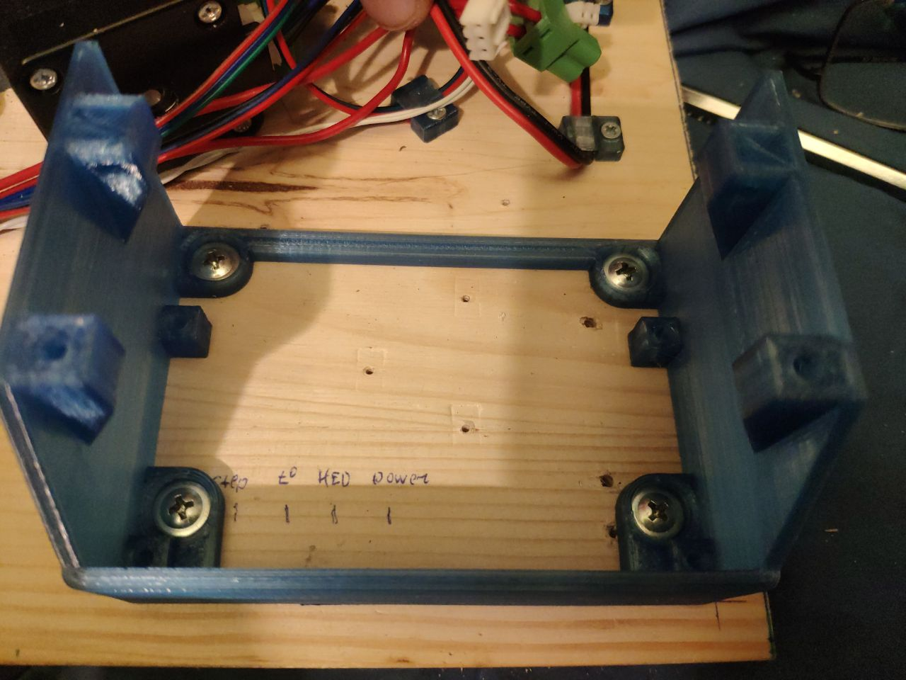
2. закрепляем плату в основной части корпуса винтами DIN912 M3 x 5

3. подключаем кабели идущиё из корпуса наружу (питание, нагреватель, термистор, датчик окончания ленты, датчик обрыва прутка)
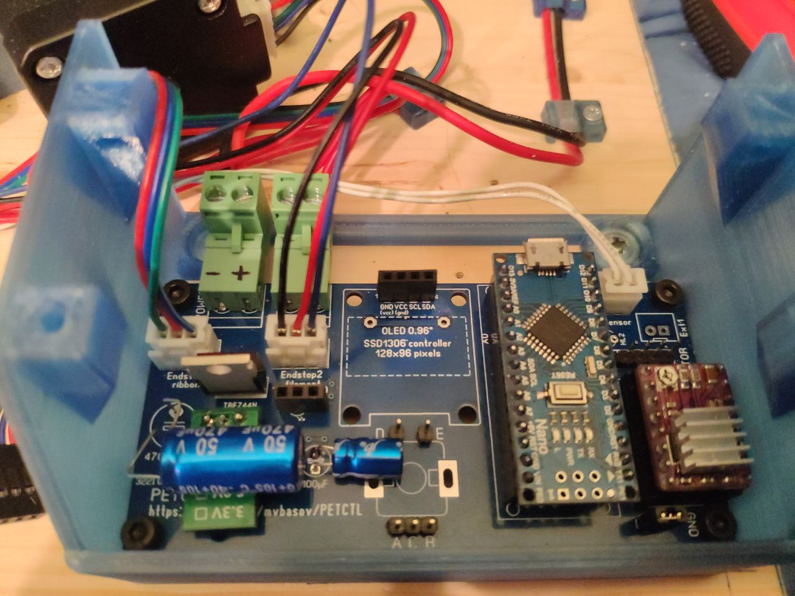
4. монтируем на переднюю панель OLED, энкодер и светодиод и припаиваем кабели к энкодеру и светодиоду. Для OLED готовим кабель с разъёмами Dupont на конце. [Vasily Afanasyev](https://github.com/h4lf) разработал [переднюю панель](https://github.com/mvbasov/PETCTL/tree/github/PCB_V09_assembly/3D_models/PETCTL_09PCB_case_V7-Front-ModLatch) с крепление дисплея на защёлках.
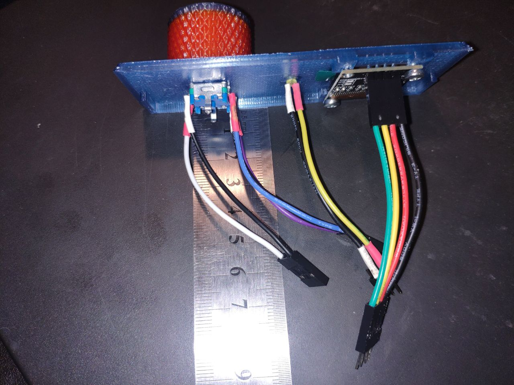
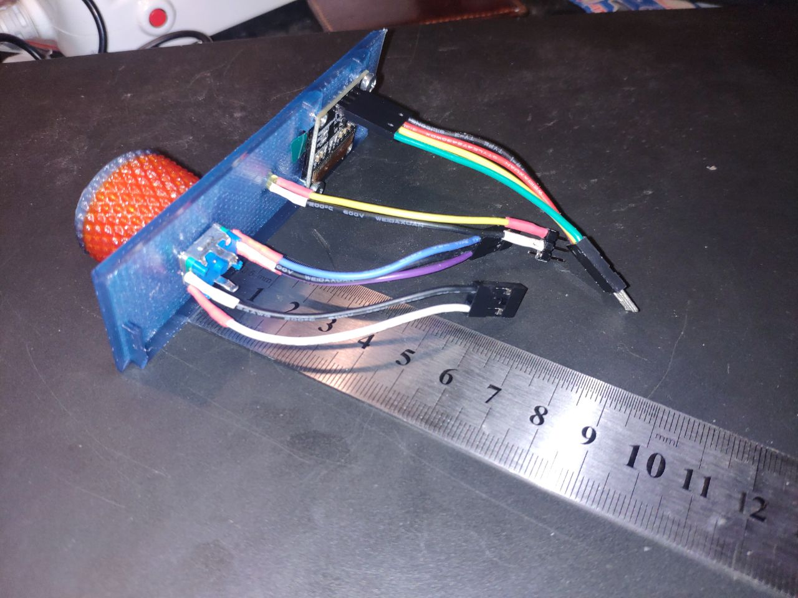
5. устанавливаем переднюю панель на место, подключаем кабели к плате и фиксируем верхней/задней частью корпуса
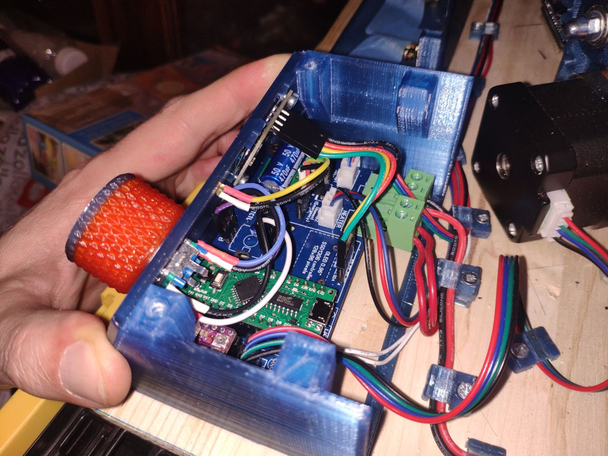
6. Прикручиваем верхнюю/заднюю часть корпуса саморезами DIN7982TX сверху 3.5 x 16, сзади 3.5 x 25
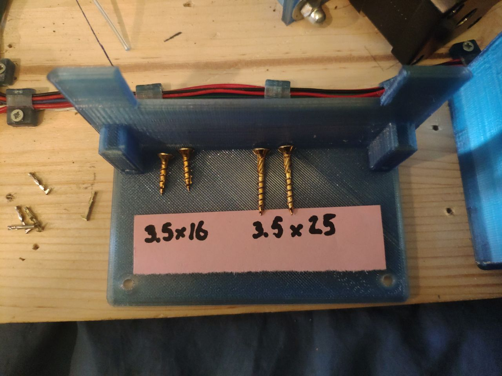
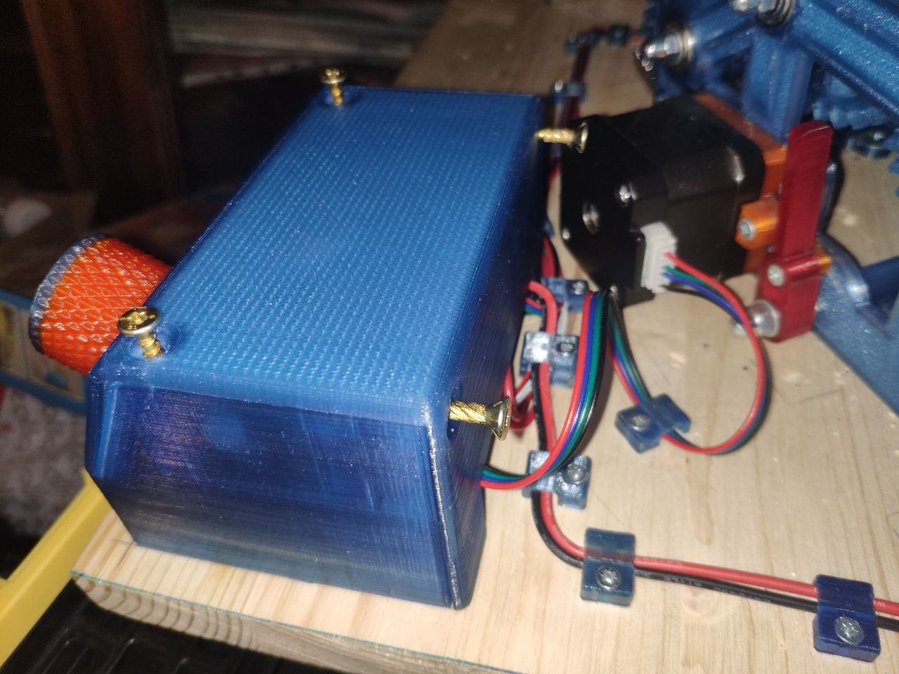
7. Наслаждаемся результатом :)
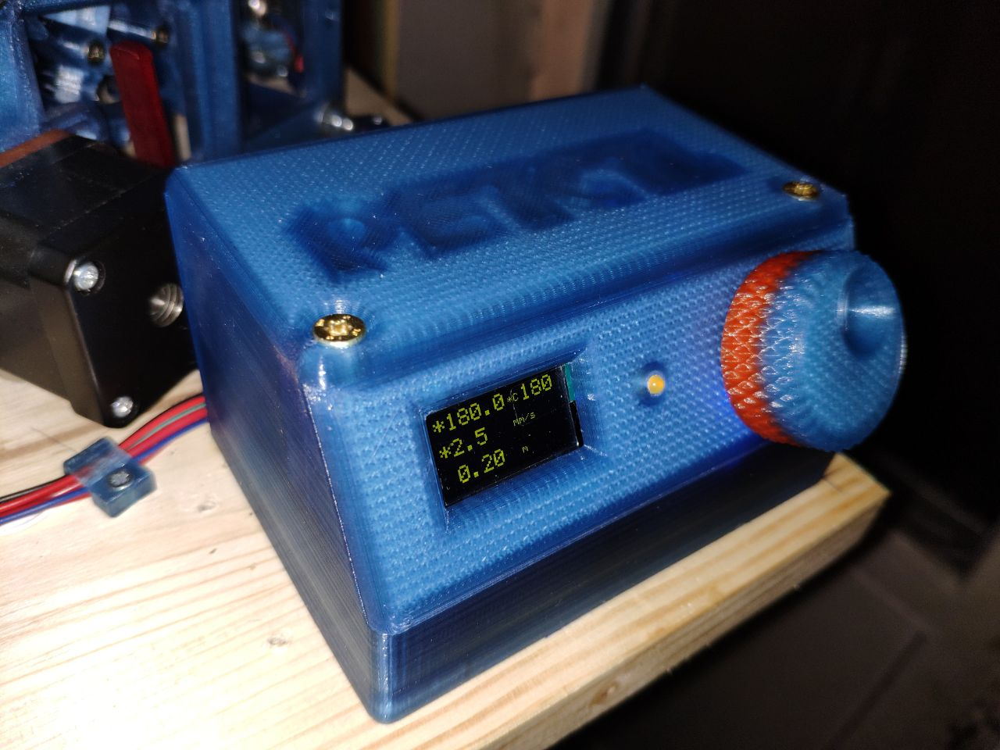
